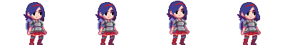
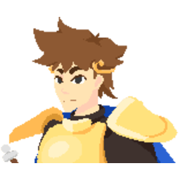

 

# 2D Movement Tutorial | Project Moonstone #
[Godot Tutorial 2D - Beginner Level Platformer Controller](https://www.youtube.com/watch?v=aQazVHDztsg) by [IcyEngine](https://icyengine.itch.io/) ([Discord](https://discord.com/invite/Ev9g6kBPnN))

This video tutorial is a friendly, follow-along project that walks viewers through the development of a simple 2D player controller, illustrating how movement logic, physics handling, input systems, and animation behaviors are typically organized and implemented in the Godot Engine to create a functional 2D platforming game. It also served as the foundation for completing a structured implementation task on Feather, with the project integrated into the wider development workflow supporting the Handshake AI Project Moonstone initiative.

# Assets #
[Girl Knight Character Asset](https://jumpbutton.itch.io/girlknightasset) by [JumpButton](https://jumpbutton.itch.io/) ([Ko-fi](https://ko-fi.com/jump_button))

# Create a Godot task #
<ins> **Step 1: Context setting** </ins>
 
Please include the following context-setting data about the tutorial and segment you selected.

OS version: Windows 11 Pro

Application version: Godot Engine v4.6.stable.official [89cea1439]

<ins> Description of the task/project you selected </ins>
 
This task involves implementing basic 2D player movement in the Godot Engine using a pixelated girl knight character sprite. This project will include handling keyboard input for walking, running, jumping, high jumping, wall jumping, and dashing. Furthermore, a responsive camera will dynamically track the player's movements and properly display the gameplay experience. This task will follow a YouTube video tutorial titled "Godot Tutorial 2D - Beginner Level Platformer Controller" created by IcyEngine, using the time segment from approximately 00:28 to 16:56.

- Start Point: https://youtu.be/aQazVHDztsg?si=8N-WDn4JTJ_JE8T0&t=28
- End Point: https://youtu.be/aQazVHDztsg?si=8N-WDn4JTJ_JE8T0&t=1016

In this segment, the video tutorial demonstrates how to set a pixelated character sprite from a PNG image, configure the required nodes, establish the collision and physics for the sprite asset, define input actions, write GDScript for the movement speed, including walking, running, jumping, dashing, deceleration, and acceleration, and modify the 2D environment with an obstacle. The starting state is a new Godot project with an empty 2D scene, and the ending state is a playable scene where the player character sprite can walk, run, jump, wall jump, and dash within a basic 2D game environment, and a responsive camera will smoothly track the player character to display the gameplay effectively.

<ins> Briefly describe the inputs to / input state of this project. </ins>
 
The input state consists of a newly created Godot Engine project with a basic 2D environment, using a pixelated Girl Knight sprite from the Girl Knight Character Asset pack created by JumpButton on itch.io. In this task, I will use a single idle frame from the "Idle_KG_1.png" sprite sheet in the "Knight_player" graphics pack as the player character sprite and primary texture asset for the 2D movement system. https://jumpbutton.itch.io/girlknightasset

<ins> **Step 2: Task completion** </ins>
 
Screen recordings and intermediate artifacts.

<ins> Brief description of the breakpoint-1 </ins>
 
Starting with the YouTube video tutorial, I created a new Godot project named "2D Movement Tutorial," opened the 2D workspace at the top, and organized it with Scenes, Scripts, and Sprites folders. I then created and saved a Main 2D scene and imported the "Idle_KG_1.png" image from the Girl Knight Character Asset pack as the first sprite asset. I then created and saved a separate Player scene, added a root "CharacterBody2D" node, attached a "CollisionShape2D" child node, opened the "Inspector," clicked on "Shape," and selected a new "RectangleShape2D" collision from the drop-down list. I attached a "Sprite2D" child node to the "Player" node and added the "Idle_KG_1.png" sprite asset to the "Sprite2D" child node by dragging the asset from the created "Sprites" folder to the empty slot next to "Texture" in the "Inspector." To use a single idle frame as the main sprite, I enabled the "Region" feature when inspecting the "Sprite2D" child node, clicked on "Edit Region," zoomed into the "Region Editor," clicked on the drop-down list next to "Snap Mode," and clicked on "Auto Slice" to choose the first idle sprite from the left side of the asset. To improve the asset's visual quality, I changed the project's default texture filter to "Nearest," centered the sprite in the 2D environment, and resized the rectangle collision shape to exactly 27.0 px by 60.5 px to match the sprite's dimensions. I then attached a GDScript to the player by clicking on the Player root node, opening the "Script" drop-down list in the "Inspector," and selecting "New Script" to write in Godot's own scripting language. I enabled the template script, set the script to "CharacterBody2D: Basic Movement", and named the script file "PlayerController.gd" to save it in the "Scripts" folder.

<ins> Brief description of the breakpoint-2 </ins>
 
Continuing with the YouTube tutorial, I returned to the "Main" scene, opened the "Scenes" folder, and dragged the "player.tscn" file into the scene so it appeared within the default camera view. When I ran the scene, the sprite immediately fell off the screen, so I fixed this by adding a "StaticBody2D" child node of the main root node and attaching a "CollisionShape2D" to serve as a platform. In the "Inspector," I set its Shape to a new "WorldBoundaryShape2D" and positioned it beneath the sprite so the player would stand on the floor when the scene runs. To ensure the player character behaved with the intended physics, I verified that the scene gravity was set to 980 px/s² by opening "Project Settings," navigating to the "Physics" section, selecting "2D," and confirming the default gravity value. I then returned to the script file through the "Script" tab at the top of the screen, where I located the default player script template and prepared to modify the code by adding custom gameplay actions and input bindings. I clicked on "Project Settings" at the top left corner of the screen, then selected the "Input Map" tab in the new window to add new actions named "left," "right," "run," and "jump" to assign these input actions to the left and right arrow keys, the Shift key, and the Space key for player movement. To enable proper keyboard control, I updated the script by replacing the default "ui_accept," "ui_left," and "ui_right" inputs with the custom "jump," "left," and "right" actions.

<ins> Brief description of the breakpoint-3 </ins>
 
Working with the YouTube video tutorial, I continued refining the script by replacing the constant speed value with a variable named "walk_speed" with a value of 150.0 to update the rest of the script to use this new variable for movement calculations. I want to change the "walk_speed" variable value directly from within the "Inspector," so I added an "@export" annotation in front of the "walk_speed" variable to enable a new setting in the "Inspector" to directly change the "walk_speed" value without changing the code in the script. I then added two new variables, "deceleration" and "acceleration", with a default value of 0.1, and included an "@export_range" annotation with a range of 0 to 1 to allow controlled adjustment in the "Inspector." I then revised the script to integrate these two new variables, enabling the player's acceleration and deceleration to be dynamically adjusted during gameplay. I added another variable named "run_speed" with a value of 250.0 and included the same "@export" annotation in front of the "run_speed" variable. I then introduced a "speed" variable that dynamically toggles between walking and running depending on whether the user is holding the run input. I integrated this "speed" variable throughout the script to interact seamlessly with the existing "acceleration" and "deceleration" variables. I created another accessible "@export" annotation variable named "jump_force" with a value of -400.0 to control the player character's jumping movement, and implemented this new variable throughout the script to replace the constant. I created and reflected another accessible annotation variable, "@export_range", named "decelerate_on_jump_release" with a range of 0 to 1 and a value of 0.5 to control a mechanic in the script where the length of time pressing the jump input determines the jump height of the player character.

<ins> Brief description of the breakpoint-4 </ins>
 
Following the YouTube video tutorial, I implemented a wall-jumping mechanism by first adding a wall obstacle in the main scene by adding a second "StaticBody2D" child node to the Main root node, and then attaching another "CollisionShape2D" child node to that "StaticBody2D" node, and then setting the collision shape to a rectangle again. To better visualize the rectangle collision shape for the wall, I attached a white "ColorRect" child node to the second "StaticBody2D" node. And then resized it to match the collider's size and used the skill tool on the visualized rectangle collision to create a thick vertical wall. I then returned to the script to add code that enables the player character to jump from the floor or perform a wall jump against the white vertical wall in the main scene. Back in the main scene, I added a "Camera2D" child node to the "Player" node and enabled "Position Smoothing" in the "Inspector" to ensure the camera dynamically tracks the player character moving during gameplay. I also enabled the "Drag" feature for Horizontal and Vertical movement with default values, changed the "Process Callback" to "Physics," and zoomed into the scene to have a more suitable camera view. I want the character to have a new dashing action, so I navigated to the "Input Map" in the "Project Settings" and created a dash action assigned to the Ctrl key. I then returned to the script to add more accessible "@export" variables to control the dashing movement of the player character during gameplay, called "dash_speed" to set the dash speed when dashing, "dash_max_distance" to set the maximum distance when dashing, "dash_curve" to control the curve of the dash speed, and "dash_cooldown" to set the time the player character has to wait before being able to dash again. I then added variables that shouldn't appear in the "Inspector" called "is_dashing" to keep track of when the player character is dashing, "dash_start_position" to calculate if the player character reached the maximum distance, "dash_direction" to remember what direction the player character dashed into, and "dash_timer" to check that the player character can't dash while on cooldown.

<ins> Brief description of the breakpoint-5 </ins>
 
Concluding with the YouTube video tutorial, I implemented multiple if statements that use these dashing variables to validate movement conditions, such as checking whether the player is already dashing, whether the dash cooldown timer has ended, and whether the player is allowed to dash based on their current state. These checks calculate the dash direction in real time, record the starting position, and track the distance traveled to ensure the dash stays within its defined limit. The logic also responds differently when the player collides with obstacles when dashing, allowing the dash to stop early if a wall or other collider is detected. I also implemented logic to manage the dash cooldown by initializing, updating, and resetting a timer that prevents the player from dashing again until the cooldown is complete. Lastly, I configured the dash curve in the "Inspector" to shape the dash speed over time, so it begins quickly and smoothly slows down toward the end. The final result should be a functional, responsive game in which the player character can walk, run, jump, wall-jump, and dash in a 2D environment.

<ins> **Step 3: Task specification** </ins>
 
Prompt reference file(s).

<ins> Reference link/description </ins>
 
Godot Tutorial 2D - Beginner Level Platformer Controller by [IcyEngine](https://www.youtube.com/@IcyEngine): https://www.youtube.com/watch?v=aQazVHDztsg

<ins> Reference link/description </ins>
 
Girl Knight Character Asset from the Knight_player_1.4 Pack by [JumpButton](https://x.com/jump_button): https://jumpbutton.itch.io/girlknightasset

<ins> Final Prompt </ins>
 
In the Godot Engine, create a playable 2D scene with a resolution of 1152 x 648, featuring a controllable player character using a pixelated sprite. The project should feature a pixel-art sprite of an armored girl knight carrying a sword and shield on her back as the only character asset, rendered clearly and sharply in a 2D scene with a solid #4d4d4d background. The project must use a gravity value of exactly 980.0 pixels per second squared to ensure correct player behavior within the game environment. Using the designated sprite asset for smooth player movement, the acceleration variable determines how quickly the player accelerates when starting to walk or run, and the deceleration variable governs how gradually the player decelerates when stopping. In the Input Map settings, there must be input actions named "left," "right," "run," "jump," and "dash" with corresponding arrow key bindings for horizontal movement, the Shift key binding for running, the Space key binding for jumping, and the Ctrl key binding for dashing. During gameplay, holding the Shift key while pressing the left or right arrow key should increase the player character's speed, returning to normal once the Shift key is released. The player character must support a variable-height jump mechanic in the script, where the jump input duration determines the jump height.

The player character must also support dashing when pressing the Ctrl key towards the direction the player character is moving, and only allow the player character to dash after a cooldown or if there isn't an obstacle that would stop the player character from dashing. The dash movement should be configurable via a dash curve line that starts at a high speed and gradually decreases over time, producing a smooth deceleration during the dash. The dash mechanic must include a programmable distance cap to ensure the player character travels a fixed maximum length during the execution state, preventing clipping and maintaining level constraints. To ensure the player character remains fully under the user's control, the character moves only while the player provides input. When the player presses any input action key, the character responds immediately and stops as soon as the input key is released, ensuring no autonomous movement occurs during gameplay. For body collision detection, the player character should utilize a 2D rectangular collision shape to ensure precise physics handling and 2D-controlled movement when interacting with platforms and obstacles within the game environment. To ensure accurate collision detection, the player character's rectangular collision shape must be exactly 27.0 px by 60.5 px to match the sprite asset size. For world boundary collision detection, an invisible platform must utilize a world boundary shape collision to create an infinite horizontal floor for the player character to stand on.

The vertical wall obstacle should use a rectangular collision shape to allow precise contact detection for wall interactions and wall-jumping mechanics. The main scene must include a solid white vertical wall obstacle that the player character can collide with and use for wall jumping. The camera node should maintain a consistent view of the main scene and smoothly follow the player character as they move through the game environment. In the GDScript code, the player character's walking speed, running speed, jump height, and jumping mobility are adjustable through the variables "walk_speed," "run_speed," "jump_force," and "decelerate_on_jump_release." In the GDScript code, the player character's dash speed, maximum dashing distance, dash curve, and dash cooldown limit are accessible and adjustable variables named "dash_speed,"  "dash_max_distance," "dash_curve," and "dash_cooldown." This project should also include well-organized movement mechanics implemented in GDScript, featuring custom input actions, adjustable settings for movement speed, jumping, dashing, and acceleration and deceleration systems to enhance responsive player controls. The final project delivers a functional 2D game featuring robust player movement, including collision detection and real-time behaviors such as walking, running, jumping, wall jumping, and dashing, using Godot's built-in physics and the defined Input Map actions.

<ins> Rubric Items </ins>
 
1. The playable game is a 2D scene environment.
- Open the main scene and confirm that it uses a "Node2D" node to view the environment in the 2D editor.
- The prompt requires that the project include a playable 2D game environment.

2. The project's viewport width is 1152.
- Confirm that the Viewport Width value equals 1152 by navigating to "Project Settings," then "Display," and then "Window."
- The prompt requires that the project's resolution be 1152 x 648. Because these values are individually adjustable, each should receive partial credit.

3. The project's viewpoint height is 648.
- Confirm that the Viewport Height value equals 648 by navigating to "Project Settings," then "Display," and then "Window."
- The prompt requires that the project's resolution be 1152 x 648. Because these values are individually adjustable, each should receive partial credit.

4. The scene's background color is filled with the color #4d4d4d.
- Verify that the Default Clear Color hex value is #4d4d4d by clicking on "Project Settings," then "Rendering," and then "Environment."
- The prompt requires that the entire scene background be painted with the color code #4d4d4d.

5. The project's physics gravity value is 980 pixels/s^2.
- Confirm that the Default Gravity value equals 980.0 px/s^2 by clicking "Project Settings," then "Physics," and then "2D."
- The prompt requires that the project's physics gravity be exactly 980.0 pixels per second squared for the environment.

6. The sprite asset renders with a clearly visible pixel-art texture.
- Run the game scene and visually confirm that the sprite asset appears with a sharp, crisp texture.
- The prompt requires that the sprite asset display a clearly visible pixel-art texture with crisp edges and preserved detail.

7. The sprite utilizes a pixelated Girl Knight carrying a sword and shield.
- Run the game scene and visually confirm that only the pixelated Girl Knight sprite is visible as the player character.
- The prompt requires that the sprite asset of an armored girl knight carrying a sword and shield must be the only player character.

8. Pressing the left arrow key moves the player character to the left.
- Run the main scene, then press the left arrow key to observe the leftward movement.
- The prompt requires that pressing the left arrow key should move the sprite asset to the left.

9. Pressing the right arrow key moves the player character to the right.
- Run the main scene, then press the right arrow key to observe the movement to the right.
- The prompt requires that pressing the right arrow key should move the sprite asset to the right.

10. Pressing the Shift key makes the player character move faster.
- Run the main scene and hold down the Shift key while pressing any movement key to observe the sprite increase movement speed.
- The prompt requires the player character to sprint and increase horizontal movement speed when moving in the environment.

11. Pressing the Space key triggers the player character to jump up.
- Run the main scene, then press the Space key to observe the player character jump upward.
- The prompt requires that pressing the Space key should cause the sprite asset to jump up.

12. Holding down the Space key makes the player character jump higher.
- Run the main scene, press and hold down the Space key, and observe the sprite asset perform a high jump.
- The prompt requires that pressing and holding down the Space key should trigger the sprite asset to jump higher.

13. Pressing the Ctrl key makes the player character quickly dash.
- Run the main scene, press the Ctrl key while pressing a movement key, and observe the sprite asset instantly dash towards a direction.
- The prompt requires that pressing the Ctrl key should cause the sprite asset to dash in the direction it is moving.

14. The player character stops moving when any input key is released.
- Run the main scene, press any input action key, then release the action key to observe whether movement ceases instantly.
- The prompt requires that the player character stop moving immediately when any pressed input action key is released.

15. The player character uses a rectangular collision shape.
- Open the player scene and inspect that it uses a "CollisionShape2D" child node with a 2D rectangle shape for body physics collision.
- The prompt requires that the player character include appropriate physics and collision handling to support controlled movement.

16. The size of the collision rectangle shape is exactly 27.0 px by 60.5 px.
- Confirm that the "Size" value is 27.0 x 60.5 px by clicking the first "CollisionShape2D" node, and then "Rectangle" in the "Inspector."
- The prompt requires the collision rectangle shape to be set to 27.0 px by 60.5 px to match the sprite's dimensions.

17. The player character uses the uploaded sprite asset texture.
- Open the player scene and verify that it uses a "Sprite2D" node with the uploaded asset as its texture.
- The prompt requires that the sprite asset of an armored girl knight carrying a sword and shield must be the only player character.

18. There is an invisible platform for the player character to move on.
- Open the main scene and verify that it uses a "StaticBody2D" child node to create a platform with collision for the sprite to stand on.
- The prompt requires that the game environment include appropriate physics and collision handling to support controlled movement.

19. The invisible platform uses a world boundary collision shape.
- Open the main scene and confirm the scene tree has a second "CollisionShape2D" node containing a 2D world boundary shape.
- The prompt requires that the game environment include appropriate physics and collision handling to support controlled movement.

20. There is a wall obstacle for the player character to wall jump against.
- Open the main scene and confirm that it includes a second "StaticBody2D" node to add a wall with collision for wall jumping.
- The prompt requires that the game environment include appropriate physics and collision handling to support controlled movement.

21. The wall obstacle uses a rectangular collision shape.
- Open the main scene and confirm that it uses a third "CollisionShape2D" node with a rectangle shape for wall collision.
- The prompt requires that the game environment include appropriate physics and collision handling to support controlled movement.

22. There is a ColorRect node to visualize the wall obstacle.
- Open the main scene and confirm that it uses a "ColorRect" node to visualize a wall obstacle collision for the sprite to wall-jump against.
- The prompt requires that the main scene include a vertical wall obstacle for the sprite asset to collide with and wall-jump against.

23. The entire wall obstacle is colored solid white.
- Confirm that the color hex value equals #ffffff by clicking on the "ColorRect" node, then clicking the "Color" box in the "Inspector."
- The prompt requires the vertical wall obstacle to use the color code #ffffff to visualize and detect collisions with walls.

24. The entire wall obstacle is not colored solid white.
- Confirm that the color value does not equal #ffffff by clicking the "ColorRect" node, then clicking the "Color" box in the "Inspector."
- The prompt requires the vertical wall obstacle to use the color code #ffffff to visualize and detect collisions with walls.

25. The player character is consistently displayed on-screen.
- Open the main scene and confirm that the scene tree uses a "Camera2D" node to always display the sprite in the environment.
- The prompt requires smooth camera tracking to maintain a stable and consistent view of the player character throughout gameplay.

26. The sprite's walking speed is adjustable by a "walk_speed" variable.
- Inspect the GDScript code for a clearly modifiable "walk_speed" variable that controls the player character's walking speed.
- The prompt requires that the GDScript code include a modifiable variable to control and adjust the player character's walking speed.

27. The sprite's running speed is adjustable by a "run_speed" variable.
- Inspect the GDScript code for a clearly modifiable "run_speed" variable that controls the player character's running speed.
- The prompt requires the GDScript code to include a modifiable variable to adjust the player character's running speed.

28. The sprite's movement speed increases by an "acceleration" variable.
- Inspect the GDScript code for a modifiable "acceleration" variable that controls the player character's increased movement speed.
- The prompt requires that the GDScript code include a modifiable variable to adjust the player character's acceleration.

29. The sprite's movement speed decreases by a "deceleration" variable.
- Inspect the GDScript code for a modifiable "deceleration" variable that controls the player character's decreased movement speed.
- The prompt requires that the GDScript code include a modifiable variable to adjust the player character's deceleration.

30. The sprite's jumping action is adjustable by a "jump_force" variable.
- Inspect the GDScript code for a modifiable "jump_force" variable that controls the player character's upward jumping velocity.
- The prompt requires that the GDScript code include a modifiable variable to adjust the player character's vertical jump velocity.

31. A "decelerate_on_jump_release" variable controls the jump height.
- Inspect the GDScript code for a "decelerate_on_jump_release" variable that controls the player character's maximum jump height.
- The prompt requires the GDScript code to include a modifiable jump height variable that controls the player character's jump height.

32. The sprite's dashing speed is adjustable by a "dash_speed" variable.
- Inspect the GDScript code for a modifiable "dash_speed" variable that controls the player character's dashing movement speed.
- The prompt requires the GDScript code to include a modifiable variable that controls the player character's dash speed.

33. The maximum dash is adjustable by a "dash_max_distance" variable.
- Inspect the GDScript code for a modifiable "dash_max_distance" variable that controls the player's maximum dash distance.
- The prompt requires the GDScript code to include a modifiable variable that controls the player's maximum dash distance.

34. The sprite's dashing curve is adjustable by a "dash_curve" variable.
- Inspect the GDScript code for a modifiable "dash_curve" variable that controls the player character's dashing movement curve.
- The prompt requires the GDScript code to include a modifiable variable that controls the player character's dash movement curve.

35. The sprite's dashing limit is adjustable by a "dash_cooldown" variable.
- Inspect the GDScript code for a modifiable "dash_cooldown" variable that affects the player character's dashing cooldown.
- The prompt requires the GDScript code to include a modifiable variable that controls the player character's dash cooldown time.

36. The dash curve starts dashing fast and slows down towards the end.
- Click the "Dash Curve" drop-down to confirm that the curve line on the graph starts high and gradually decreases until a specific point.
- The prompt requires the dash curve to be configurable, starting fast and gradually slowing to control the player character's dash speed.

37. The Input Map includes a "left" action bound to the left arrow key.
- Confirm an input action exists with the left arrow key by navigating to "Project Settings" and then to "Input Map" to see the "Action" list.
- The prompt requires that the left arrow key be assigned as a keyboard input action to control the player character in the scene.

38. The Input Map includes a "right" action bound to the right arrow key.
- Confirm an input action exists with the right arrow key by navigating to "Project Settings" and then to "Input Map" to see the "Action" list.
- The prompt requires that the right arrow key be assigned as a keyboard input action to control the player character in the scene.

39. The Input Map includes a "run" action bound to the Shift key.
- Confirm an input action exists with the Shift key by navigating to "Project Settings" and then to "Input Map" to see the "Action" list.
- The prompt requires that the Shift key be assigned as a keyboard input action to control the player character in the scene.

40. The Input Map includes a "jump" action bound to the Space key.
- Confirm an input action exists with the Space key by navigating to "Project Settings" and then to "Input Map" to see the "Action" list.
- The prompt requires that the Space key be assigned as a keyboard input action to control the player character in the scene.

41. The Input Map includes a "dash" action bound to the Ctrl key.
- Confirm an input action exists with the Ctrl key by navigating to "Project Settings" and then to "Input Map" to see the "Action" list.
- The prompt requires that the Ctrl key be assigned as a keyboard input action to control the player character in the scene.
 
Godot - Full Vertical Slice (Game Prototype) - Finished prompt creation.

---

# Gold Adventure | Project Touchstone #
[Godot 2D Sprite Animation - The Basics in 4 Minutes](https://www.youtube.com/watch?v=-f1bHR0iiEY) by [IcyEngine](https://icyengine.itch.io/) ([Discord](https://discord.com/invite/Ev9g6kBPnN))

This video tutorial is a friendly, follow-along project that walks viewers through the development of a simple 2D player controller, illustrating how movement logic, physics handling, input systems, and animation behaviors are typically organized and implemented in the Godot Engine to create a functional 2D platforming game. It also served as the foundation for completing a structured implementation task on Feather, with the project integrated into the wider development workflow supporting the Handshake AI Project Touchstone initiative.

# Assets #
[Golden Knight Character Asset](https://apyryon.itch.io/free-sample-fantasy-saga-7-golden-knight-2d-character-portrait) by [ApyrYon](https://apyryon.itch.io/) ([Instagram](https://www.instagram.com/apyr.dev/?next=%2F)) and [Pixel Art Platformer - Village Props](https://cainos.itch.io/pixel-art-platformer-village-props) by [Cainos](https://cainos.itch.io/) ([Twitter](https://twitter.com/cainos_chen))

# Create a Godot task #
<ins> What application is this task for? </ins>
 
Godot

### **Task prompt** ###
First, enter the **task prompt** and any relevant reference files (e.g., docs, diagrams, sketches, photos, schematics).

Tasks should sound like what a manager might give a skilled but junior employee: high-level guidance with some leeway on executional details, but with very clear success metrics. What a good outcome looks like must be very clear and easy to understand.

Include any relevant **reference files** (docs, diagrams, sketches, photos, schematics, etc) needed for someone to complete this task.

Reminder on the difference between reference and starting state files:
- **Reference files**: anything the Employee should look at or read while completing the project that does not need to be directly loaded into the application (*'please make something that looks like XYZ image'*)
- **Starting state files (upload below)**: anything that the Employee would need to load into their workspace to complete the task (*'here is the existing file you should adapt'*)

<ins> Task prompt (ask the Employee) </ins>
 
We are beginning development for the player controller of a new 2D pixel-art platformer prototype. Your task is to design and implement a functional player movement system using a pixelated sprite of a golden knight character, establishing the core mechanics and a responsive gameplay foundation. The movement system should prioritize smooth, precise, and consistent control by incorporating well-structured keyboard input handling, realistic physics behavior, and a responsive camera system. All visual assets, including the player sprite, environment props, terrain, and UI elements, should render sharply and clearly without distortion, preserving the visual clarity expected in a pixel-art environment. You will set up the necessary nodes, apply the pixelated character sprite, and configure collision and physics properties to ensure proper interaction with the environment. The player character must respond to keyboard inputs for horizontal movement, jumping, sprinting, dashing, attacking, and interacting while demonstrating natural physics behavior throughout gameplay. The player character should remain visible and correctly oriented in the camera view at all times to maintain a consistent on-screen experience. The player character should be able to approach a treasure chest in the level and press the X key to trigger an interaction that plays the chest's opening animation. The system must include an Escape key toggle to pause and resume gameplay and display a pause screen overlay. The game must also track player health and automatically reset the level when the health bar reaches zero. The completed system must include gameplay UI elements that update in real time for a coin counter to track collected coins, a health bar that reflects player damage, and a dash cooldown indicator that shows when the dash ability is ready to be used again. The completed movement system should support the following abilities:

- Horizontal movement allows the player character to walk left.
- Horizontal movement allows the player character to walk right.
- A normal jump allows the player character to propel upward slightly.
- A variable jump height enables the player character to jump higher.
- Wall jumping allows the player to ascend upward along the wall.
- Sprinting at a running speed allows for faster horizontal movement.
- A directional dash movement for short bursts of horizontal speed.
- Directional attacking lets the player character strike with a sword.
- Implement player interaction to open treasure chests in the level.
- Movement includes acceleration and deceleration for transitions.

The level must include collectible yellow coins that increment the coin counter when the player character collects them. The environment must also include grey spike hazards that damage the player on contact, reducing the health bar accordingly. The level environment must use a consistent dark gray background color, and vertical motion should behave properly with gravity, producing a natural downward pull. Interactions with the environment must be stable and precise, allowing the character to move seamlessly across surfaces, respond accurately to barriers, and maintain proper positioning without unintended overlap or clipping. The environment should include platforms and decorative elements, with a clearly defined rectangular vertical wall to facilitate wall-jumping interactions. There is no required layout for ground tiles and props, but the level should include enough platforms, ground, and walls to support gameplay and testing. The player character must always face the correct direction when moving or attacking, and all animations should play smoothly without interruption. When attacking, the player character will wield a sword, visualizing the action through an accompanying animation that reflects the direction and motion. When using the jump input, a quick tap should trigger a standard jump, while pressing and holding the input should perform a higher jump. Overall behavior should demonstrate tight responsiveness, smooth transitions between actions, and a level of polish that supports further development and improvement for advanced movement.

<ins> Which of the following best fits this task? </ins>
 
Task from scratch

<ins> How long would you anticipate an 'Employee' to complete this task? (in hours) </ins>
 
5

### **Starting state** ###
Please describe and include below any information about the starting state of this project:
- Existing work to be modified
- Other assets or other inputs the Employee needs to bring to be able to complete this task

Reminder on the difference between the starting state and the reference files:
- **Starting state files**: anything that the Employee would need to load into their workspace to complete the task ('*here is the existing file you should adapt*')
- **Reference files (upload above)**: anything the Employee should look at or read while completing the project that does not need to be directly loaded into the application ('*please make something that looks like XYZ image*')

<ins> Starting state description </ins>
 
The starting state for this task is a ZIP file containing all essential assets and UI elements for a minimal setup to begin development of this pixel-art platformer player controller. This project will utilize an imported sprite sheet for the golden knight character to create animations and visualize the player's actions, including idle, movement, jumping, and attacking. This project will include a sprite sheet for a chest animation with different colors to implement the treasure chest opening behavior and player interaction. The project will also include a sprite sheet for a spinning yellow coin animation to serve as a collectible item for the player character, requiring implementation of collection logic, collision detection, and any associated scoring mechanics. The project will also include a grey triangular spike sprite that functions as an environmental hazard, which must be placed within the level to challenge the player and configured with proper collision so that the player takes damage upon contact, requiring appropriate interaction implementation. The project will also use various terrain sprites and decorative props to create a suitable and creative environment for testing and gameplay. The Employee should create the tile map to structure the environment, and the animated player scene to attach the collision box, and organize the project with folders for assets, scenes, scripts, and resources. The Employee is responsible for creating and configuring the player controller, animation frames, camera behavior, attaching scripts, setting up nodes, defining input actions, connecting signals, and building the environment using the supplied terrain, coin, spike, chest, and prop assets. The reference files above demonstrate how the environment can look after using the ground tiles and decorative props to build a cohesive and sustainable level for testing and gameplay.

### **Overall context** ###
Finally, include context on this task and why it is realistic and representative of real-life work:
- Why is this a reasonable task for a manager to ask a junior-level employee to do?
- Is there a larger project it might be a part of?

<ins> Task context </ins>
 
This task is representative of a junior-level development assignment, as it involves implementing core gameplay mechanics in a structured environment while applying fundamental programming, problem-solving, and design principles. The project focuses on translating design requirements into functional systems and provides clear success metrics, including responsive movement, collision handling, object interaction, and camera tracking. It also reflects real-life project workflows, requiring the Employee to create a new project structure, utilize the starting state file with multiple assets, and maintain an extensible architecture for future features. The task emphasizes implementing standard platformer mechanics such as walking, running, jumping, wall jumping, dashing, interacting, and attacking, which are core elements from a wide variety of 2D platforming games. This movement system can serve as the foundation of a larger platformer project or prototype, later supporting expanded gameplay features such as enemies, weapons, various levels, challenges, and power-ups. Completing this task ensures the platformer controller is functional and reliable, providing a solid foundation for further development and more advanced gameplay mechanics.

<ins> Rubric Items </ins>
 
1. The character sprite, level terrain, and level props all appear sharp.
- Run the main scene and observe that the golden knight character sprite, level terrain, and environment props appear sharp and clear.
- The prompt requires that the golden knight character sprite, terrain platforms, and environment props remain visually sharp and clear.

2. The background color of the project level environment is dark gray.
- Run the main scene and observe that the environment's background color remains a consistent dark gray throughout the entire level.
- The prompt requires a level background in dark gray, ensuring the color remains consistent with and appropriate for the environment.

3. The animations play smoothly and always face the correct direction.
- Run the main scene and move the player character to observe smooth animation transitions and the correct facing direction.
- The prompt requires that all character sprite animations play smoothly while facing the correct direction of movement.

4. The gravity physics produces a natural and consistent downward pull.
- Run the main scene and observe the player character falling to confirm that gravity causes a natural downward acceleration.
- The prompt requires that the environment's gravity produce realistic falling behavior and a consistent downward pull for entities.

5. The Escape key toggles a pause screen to stop and resume gameplay.
- Run the main scene, press the Escape key to pause and stop the game, then press the Escape key again to resume gameplay.
- The task prompt requires a functional pause system that toggles a visible pause screen and correctly pauses and resumes gameplay.

6. A treasure chest opens when the sprite interacts with it using the X key.
- Run the main scene, move the sprite next to the chest, and press the X key to observe the treasure chest play its opening animation.
- The task prompt requires the chest to respond to player interaction input and visually play an opening animation when activated.

7. There are yellow coins to collect, and a coin counter to track the count.
- Run the main scene, move the player character into a yellow coin to collect it, and observe that the coin counter number increases.
- The prompt requires collectible yellow coins placed throughout the level and a visible coin counter that tracks the coins collected.

8. Grey spikes damage the player, and a health bar decreases when hit.
- Run the main scene, move the player character into a grey spike, and observe that the health bar decreases when damaged.
- The prompt requires environmental spike hazards that harm the player on contact, and a visible health bar that reflects damage.

9. The sprite horizontally moves with the arrow keys and stops on release.
- Run the main scene, press the left and right arrow keys to observe movement, then release them to confirm the player stops moving.
- The task prompt requires the arrow keys for horizontal movement and an immediate stop when releasing all action input.

10. The sprite jumps with the Space key and jumps higher when held.
- Run the main scene, tap the Space key to observe a normal jump, then press and hold the Space key to observe a high jump.
- The task prompt requires that tapping the Space key triggers a jump and that holding the Space key performs a high jump.

11. The player character can wall jump upward along the vertical wall.
- Run the main scene, press the Space key while against any vertical wall, and verify that the character can jump upward along the wall.
- The task prompt requires a wall-jump ability that lets the player character propel upward when jumping against a vertical wall.

12. The player character can always sprint when pressing the Shift key.
- Run the main scene, then press and hold down the Shift key while moving left or right to confirm that the sprite starts sprinting.
- The task prompt requires the player character to sprint and increase horizontal movement speed when moving in the environment.

13. The player character can quickly dash when pressing the Ctrl key.
- Run the main scene, press the Ctrl key while pressing a movement key, and observe the sprite asset instantly dash towards a direction.
- The task prompt requires that the player character can quickly dash for a short burst of horizontal movement to increase speed.

14. The player character can attack with a sword when pressing the Z key.
- Run the main scene, press the Z key on your keyboard, and observe that the player character can quickly attack with their sword.
- The task prompt requires the player character to perform a swift directional sword attack by pressing the Z key.

15. The sprite properly collides with platforms, walls, objects, and props.
- Run the main scene and move the player character across the level to confirm it collides with all terrain and environmental objects.
- The prompt requires functional collision, so the player character interacts correctly with all level environment elements.

16. The camera follows the player character smoothly during gameplay.
- Run the main scene and move the player character across the level to confirm that the game camera accurately tracks the player.
- The prompt requires smooth camera tracking to maintain a stable and consistent view of the player character throughout gameplay.

17. The game resets to the beginning when the health bar reaches zero.
- Run the main scene, take damage from the grey spikes until the health bar reaches zero, and observe that the game fully resets.
- The task prompt requires the game to detect when the player's health reaches zero and automatically restart from the beginning.

18. The dash cooldown icon visually shows when dashing is ready again.
- Run the main scene, perform a dash, and confirm that a cooldown icon appears to show when the dash ability is ready to use again.
- The task prompt requires a dash cooldown icon that provides visual feedback to the player when the dashing mechanic is off cooldown.
 
Godot - Full Vertical Slice (Game Prototype) - Finished prompt creation.
